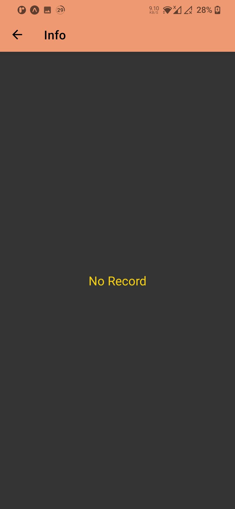

# React-Native-Challenge(Result)

Use npm install to install the require package.

Use npm start to start. After that, you will see the IOS option or Android option to run

in IOS or Android.

Result Images:

